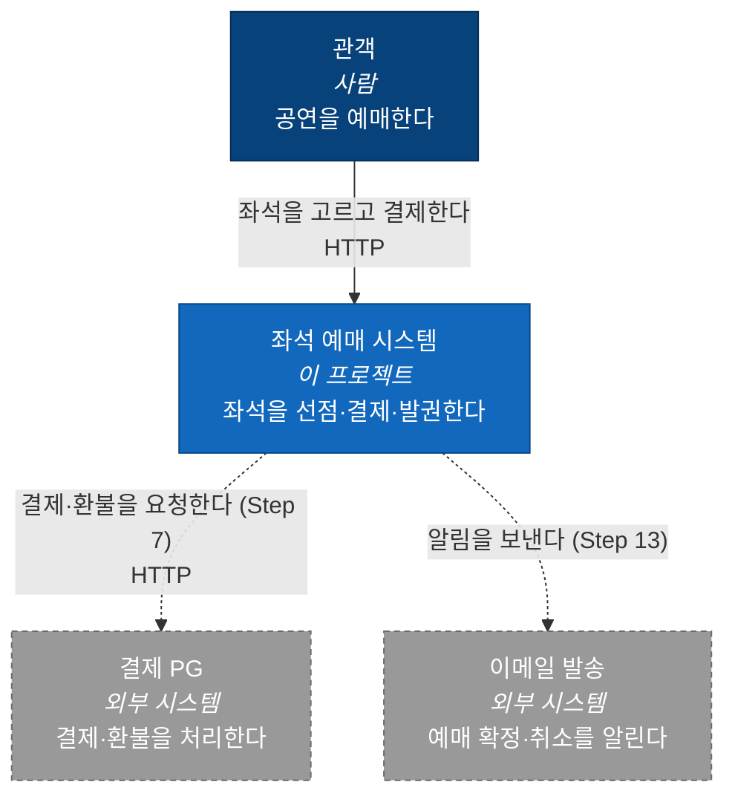
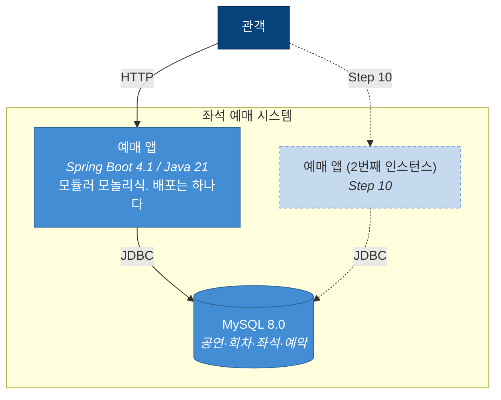
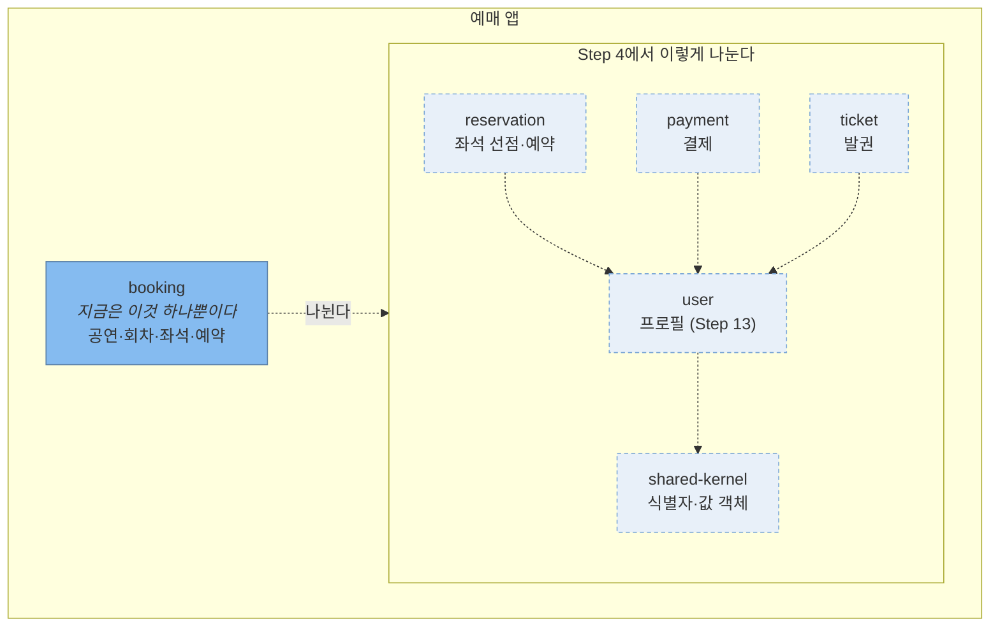

# 아키텍처

시스템을 [C4 모델](https://c4model.com/)의 세 층으로 본다. 층마다 보는 사람이 다르다.

| 층 | 무엇을 보는가 | 언제 갱신하나 |
|---|---|---|
| Context | 이 시스템과 바깥 세계 | 외부 시스템이 늘 때 (Step 7, 13) |
| Container | 따로 배포되고 따로 죽는 단위 | 프로세스·저장소가 늘 때 (Step 7, 10) |
| Component | 컨테이너 안의 모듈 | 모듈을 나눌 때 (Step 4, 5) |

그림은 Mermaid의 flowchart로 그린다. Mermaid에 C4 전용 문법이 있지만 아직 실험 단계라 레이아웃이 불안정해서,
C4의 **층 구분만 따르고** 그림 자체는 어디서나 렌더링되는 문법으로 그린다.

**점선 상자는 아직 없는 것이다.** 어느 Step에서 생기는지 함께 적는다. 지금 없는 것을 그려두는 이유는,
`ai_docs/PROBLEMS.md`의 Step들이 이 시스템을 어떤 모양으로 끌고 가는지가 한눈에 보여야 하기 때문이다.

---

## Level 1 — Context

바깥이 둘뿐이고 **둘 다 아직 없다.** 지금 이 시스템은 자기 DB만 보고 혼자 돈다.

이게 Step 7의 의미다 — 거기서 처음으로 "남의 시스템"이 생기고, 롤백으로 되돌릴 수 없는 일이 시작된다.
Step 8("보냈지만 결과를 모른다")이 필요해지는 자리가 위 그림의 점선 화살표 하나다.

---

## Level 2 — Container

**컨테이너가 앱 하나와 DB 하나뿐이라는 것**이 이 프로젝트의 출발점이다.

- 앱이 하나라서 Step 2의 보호 장치(락이든 유니크 제약이든)가 통한다. Step 10에서 인스턴스를 하나 더 띄우면
  그 전제가 깨지는지 확인한다 — 무엇이 지켜주고 있었는지 그때 드러난다
- 모듈을 넷으로 나눠도(Step 4) 이 그림은 바뀌지 않는다. **모듈은 컨테이너가 아니다.** 모듈이 컨테이너가 되는
  순간이 곧 "서비스로 떼어낸다"이고, 그 판단이 Step 12다

---

## Level 3 — Component

지금 컴포넌트는 `booking` 하나다. 나누는 것은 Step 4, 경계를 테스트로 강제하는 것은 Step 5다.

나뉜 뒤 지켜야 할 규칙은 `AGENTS.md`의 모듈 경계 규칙 표에 있다. 위 그림에서 눈여겨볼 것은
**업무 모듈끼리 화살표가 없다**는 점이다. `reservation`이 `payment`를 못 보는데 결제를 시켜야 하는 문제가
Step 6이고, 거기서 방식을 고른다.

`user`로 향하는 화살표는 여럿인데 `user`에서 나가는 화살표는 `shared-kernel`뿐이다. 이 방향이 뒤집히는 순간
(`user.canReserve()` 같은 것이 생기는 순간) 순환이 생긴다 — `AGENTS.md`의 규칙 ②가 막으려는 것이다.

---

## 지금 없는 것

그림에 아직 그리지 않았지만 Step이 진행되면 생기는 것들이다.

| 무엇 | 어느 Step | 어느 층이 바뀌나 |
|---|---|---|
| 가짜 PG (WireMock 등) | Step 7 | Context, Container |
| 앱 인스턴스 2개 | Step 10 | Container |
| 분산 락 저장소 (필요하다면) | Step 10 | Container |
| 대기열 (측정으로 필요를 보인 뒤) | Step 11 | Container |
| 이메일 발송기 | Step 13 | Context |

**필요해지기 전에 그리지 않는다.** 미리 그려두면 왜 있는지 설명할 수 없는 상자가 생긴다.
